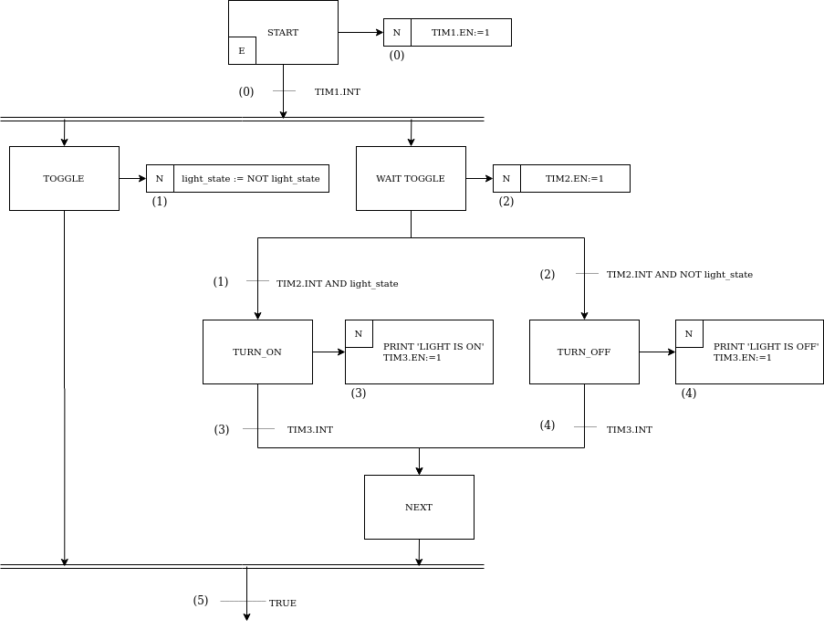

# microsfc
Create a simple C++ program directly from a sequential function chart using microsfc.
## motivation
__*microsfc*__ were built as the core library of an automation project using Arduino based PLC's. We took advantage of C++ language syntax to create an automation program keeping the basic concepts of SFC. We successfuly used this library to implement the complex routines of an injection molding machine directly from a sequential function chart. 

In this first version of __*microsfc*__ we provide just a few components of SFC. If you wish to contribute to the project please feel free to contact us. 

## Example
In this example we implemented the program below



### Setting up variables

First we declare the transition predicates and the action functions. 

``` cpp
bool transition_0();
bool transition_1();
bool transition_2();
bool transition_3();
bool transition_4();
bool transition_5();

void action_0(const stateful_state_t &state);
void action_1(const stateful_state_t &state);
void action_2(const stateful_state_t &state);
void action_3(const stateful_state_t &state);
void action_4(const stateful_state_t &state);
```

next we declate the steps and actions

``` cpp
Step steps[] = {
    Step(true),     // Q0. START
    Step(),         // Q1. TOGGLE
    Step(),         // Q2. WAIT_TOGGLE
    Step(),         // Q3. TURN_ON
    Step(),         // Q4. TURN_OFF
    Step()          // Q5. NEXT
};

Transition transitions[] = {
    Transition(
        {(int[]){0}, 1},        // Current activated steps
        {(int[]){1, 2}, 2},     // Next steps
        transition_0),          // Transition predicate
    Transition(
        {(int[]){2}, 1},        
        {(int[]){3}, 1},        
        transition_1),          
    Transition(                 
        {(int[]){2}, 1},        
        {(int[]){4}, 1},        
        transition_2),          
    Transition(                 
        {(int[]){3}, 1},        
        {(int[]){5}, 1},        
        transition_3),          
    Transition(                 
        {(int[]){4}, 1},        
        {(int[]){5}, 1},        
        transition_4),          
    Transition(                 
        {(int[]){1, 5}, 2},     
        {(int[]){0}, 1},        
        transition_5),          
};
```

Then we declare the action handlers and the action objects. We create an array with the action references.

```cpp

NonStoredAction action0 = NonStoredAction(0, {(state_handler_t[]){ 
        { ACTION_STATE_ACTIVATING, action_0 }   // action 0 is called on activating  
    }, 1});
NonStoredAction action1 = NonStoredAction(1, {(state_handler_t[]){ 
        { ACTION_STATE_ACTIVATING, action_1 }
    }, 1});
NonStoredAction action2 = NonStoredAction(2, {(state_handler_t[]){ 
        { ACTION_STATE_ACTIVATING, action_2 }
    }, 1});
NonStoredAction action3 = NonStoredAction(3, {(state_handler_t[]){ 
        { ACTION_STATE_ACTIVATING, action_3 }
    }, 1});
NonStoredAction action4 = NonStoredAction(4, {(state_handler_t[]){ 
        { ACTION_STATE_ACTIVATING, action_4 }
    }, 1});

Action* actions[] = { &action0, &action1, &action2, &action3, &action4 } ;
```

Finaly we create our application. We define a context that holds the steps, transitions and actions and pass it through the Application constructor.

```cpp
Application app = Application({
    {steps, 6}, 
    {actions, 5}, 
    {transitions, 6}
});
```

We must define three timers in this example.

```cpp
Timer tim1 = Timer(1000, false);
Timer tim2 = Timer(1000, false);
Timer tim3 = Timer(1000, false);
```

The application works as a time-event-based component. So we must define a clock and register the application within it. We must register the timers of this example in this clock too.

```cpp
Clock theClock = Clock({(ClockListener*[]) {
    &app,
    &tim1, 
    &tim2, 
    &tim3
}, 4});
```

The clock ticks every time the system performs a loop. In order to trigger the time-event based components we must provide the system time in milliseconds. 

```cpp
ulong_t sys_time_ms = ...; //system current time, eg. millis() in arduino
clock.tick(sys_time_ms);

```